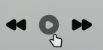
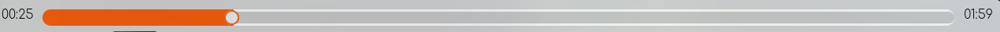
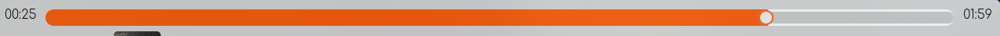
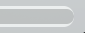
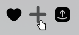
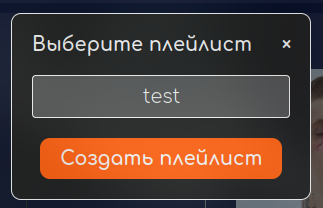
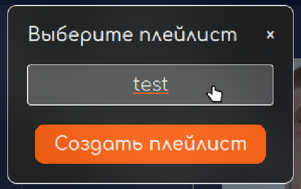
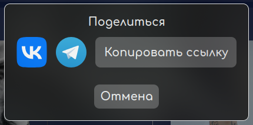
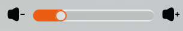
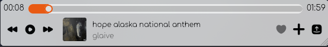

# Отчет о тестировании музыкального сервиса NovaCode

Ссылка: [nova-music.ru](http://nova-music.ru)

Ссылка backend: [NovaMusic Backend](https://github.com/go-park-mail-ru/2024_2_NovaCode)

Ссылка frontend: [NovaMusic Frontend](https://github.com/frontend-park-mail-ru/2024_2_NovaCode)

## Плеер

#### Тестовое окружение

- Браузер: Mozilla Firefox 135.0

### Воспроизведение трека (левая часть)

В левой части плеера есть три функциональные кнопки: "предыдущий трек", "воспроизведение/пауза", "следующий трек".

* При наведении кнопки: "предыдущий трек", "воспроизведение/пауза", "следующий трек", **затемняются**: 

* При нажатии на кнопку "предыдущий трек" **начинает играть предыдущий трек**;
* Если трек не играет, то при нажатии на кнопку "воспроизведение/пауза", он **начинает играть, изображение кнопки меняется**: 

* Если трек играет, то при нажатии на кнопку "воспроизведение/пауза", он **ставится на паузу, изображение кнопки меняется**: 

* При нажатии на кнопку "следующий трек" **начинает играть следующий трек**;
* При переключение трека **меняется информация о треке (автор, название трека, картинка)**.

### Воспроизведение трека (слайдер)

Слева от слайдера отображается текущее время трека, а справа — его общая длительность.

* Когда играет трек, **ползунок слайдера меняет свое положение**: 

* Когда играет трек, **текущее время трека изменяется**:
* Если сдвинуть ползунок, то **текущее время трека должно измениться**:
> [!WARNING]
> БАГ. Текущее время трека не изменяется 

* Если сдвинуть ползунок, а потом нажать на кнопку "воспроизведение/пауза" **время изменится**;
* Если во время воспроизведения сдвинуть ползунок, **трек начнет играть с новой позиции**;
* Обводка плеера **должна быть равномерной**:
> [!WARNING]
> БАГ. Обводка плеера не равномерная 

### Взаимодействие с треком

Справа от информации о треке, есть три функциональные кнопки: "лайк", "в плейлист", "поделиться".

* При наведении кнопки: "лайк", "в плейлист", "поделиться", **затемняются**: 

* Если трек лайкнут, то кнопка "лайк" **затемнена и трек добавляется в любимые треки пользователя**: 

  + Если трек лайкнут, то при наведении **внешний вид кнопки лайк не изменяется**; 
  + Если трек лайкнут, то при нажатии на кнопку "лайк" перестает затемняться и **трек удаляется из любимых треков пользователя**;
* При нажатии на кнопку "в плейлист" **открывается модальное окно для выбора плейлиста**: 

  + При наведении **кнопки "закрыть окно" и "в плейлист" не подсвечиваются**;
  + При наведении на плейлист **имя плейлиста подчеркивается**: 
  
  + Если модальное окно открыто, то плеер должен блокироваться;
> [!WARNING]
> БАГ. Если модальное окно открыто, плеер не блокируется, поэтому можно открыть еще одно модальное окно повторным нажатием на кнопку "в плейлист".
  + При нажатии на кнопку закрыть, **модальное окно закрывается**;
* При нажатии на кнопку "поделиться" открывается модальное окно с доступными способами отправки треков: 

  + При наведении **кнопки "VK", "Telegram", "Копировать ссылку",  "Отмена" не подсвечиваются**;
  + При нажатии на кнопку "VK" происходит редирект на страницу шеринга ВК;
  + При нажатии на кнопку "Telegram" происходит редирект на страницу шеринга Telegram;
  + При нажатии на кнопку "Копировать ссылку" **текст меняется на "Ссылка скопирована" и ссылка добавляется в буфер обмена**;
    - При нажатии на кнопку "Ссылка скопирована" **текст меняется на "Копировать ссылку"**;
  + При нажатии на кнопку "VK" **открывается сайт ВК, где можно  поделиться треком**;
  + При нажатии на кнопку "Telegram" **открывается сайт Telegram, где можно поделиться треком**;
  + Если модальное окно открыто, то плеер должен блокироваться;
> [!WARNING]
> БАГ. Если модальное окно открыто, плеер не блокируется, поэтому можно открыть еще одно модальное окно повторным нажатием на кнопку "поделиться".
  + При нажатии на кнопку закрыть, **модальное окно закрывается**.

### Регулирование громкости

В правой части плеера находится слайдер, с помощь которого можно регулировать громкость трека.

* При перемещении ползунка **громкость трека изменяется**;
* При нажатии на кнопки, расположенные по бокам слайдера, **уровень громкости трека должен изменяться**:
> [!WARNING]
> БАГ. При нажатии на кнопки, расположенные по бокам слайдера, уровень громкости не изменяется. 

* Если сдвинуть ползунок слайдера в крайнее левое положение **трек не должно быть слышно**;
> [!WARNING]
> БАГ. Если сдвинуть ползунок слайдера в крайнее левое положение трек будет слышен.
* При маленьком значение ширины дисплея **слайдер уровня громкости должен присутствовать**:
> [!WARNING]
> БАГ. При маленьком значение ширины дисплея слайдер уровня громкости исчезает. 
