# Отчет о тестировании музыкального сервиса NovaCode

Ссылка: [nova-music.ru](http://nova-music.ru)

## 3. Профиль

Перейти в профиль можно по клику на аватар в навбаре.

#### Тестовое окружение

- Браузер: Yandex. Version 24.7.3.1253 stable (64-bit)

### 3.1 Подписки

1. При клике на кнопку "Подписки" в карточке профиля осуществляется переход на страницу подписок пользователя.

2. Если пользователь ни на что не подписан, отображается сообщение об отсутствии подписок с информацией о том, что на что можно подписываться.

3. После подписки на исполнителя (клика на кнопку нравится в карточке артиста на странице артиста), он отображается на странице подписок пользователя.
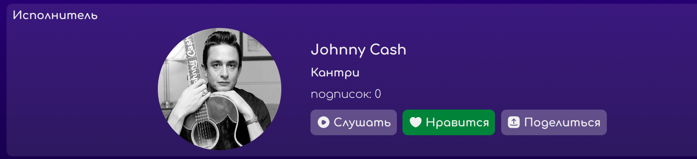
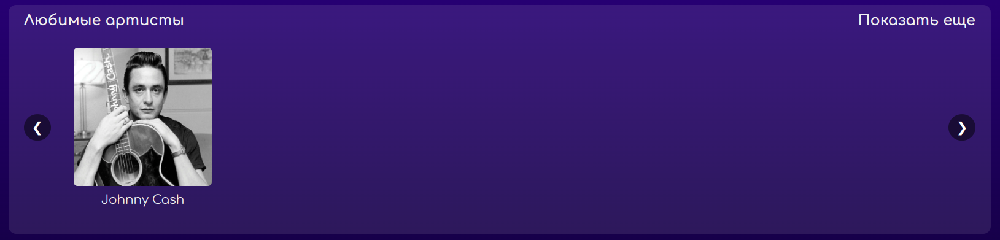

4. После подписки на альбом (клика на кнопку нравится в карточке альбома на странице альбома), он отображается на странице подписок пользователя.
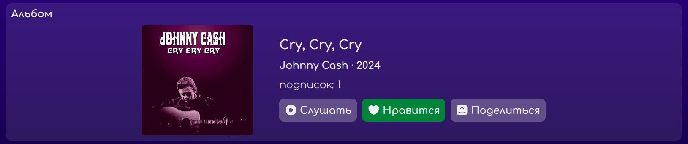
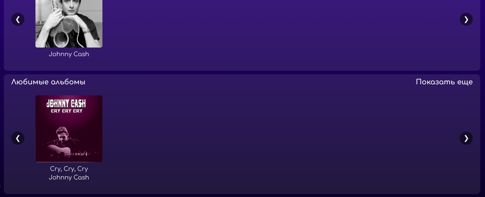

5. После подписки на плейлист (клика на кнопку нравится в карточке плейлиста на странице плейлиста), он отображается на странице подписок пользователя.
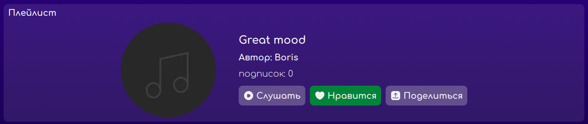
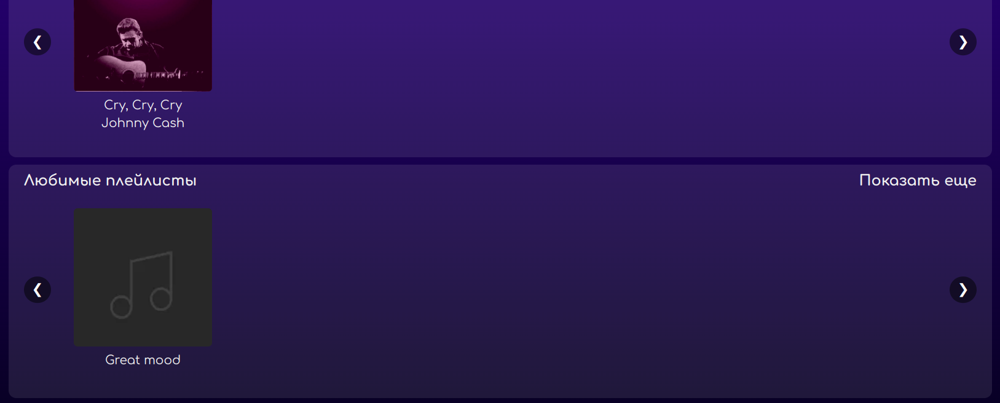

6. При отмене подписки исполнитель, альбом или артист удаляется со страницы подписок.

7. После удаления всех подписок, отображается первоначальное сообщение об отсутствии подписок с информацией о том, что на что можно подписываться.

### 3.2 Настройки профиля

1. При клике на кнопку "Настройки профиля" в карточке профиля осуществляется переход на страницу настроек профиля.

2. При клике на кпопку "Загрузить изображение" появляется возможность выбора фото из файлов.
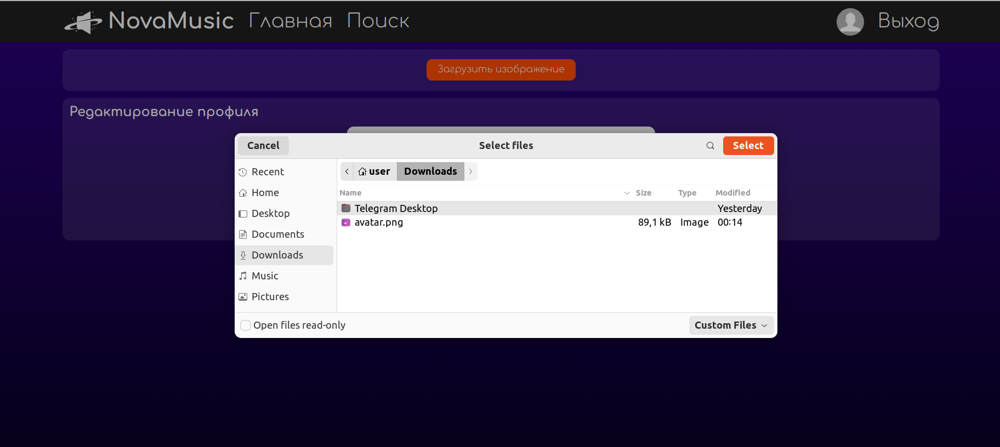

3. После выбора аватара по клику по кнопке "Загрузить изображение" происходит редирект на сраницу с карточкой профиля. Аватар изменяется на загруженный в карточке и правом углу навбара.
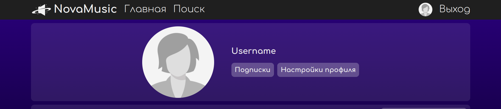

4. При загрузке непредусмотенного формата аватара по клику по кнопке "Загрузить изображение", высвечивается сообщение о некорректном вводе.
> [!WARNING]
> БАГ. При попытке ввода непредусмотренного формата аватара отсутствует сообщение об ошибке.

5. После внесения изменений в логин и клика на кнопку "Сохранить" происходит редирект на страницу с карточкой профиля. Логин в карточке профиля изменяется на введенный.
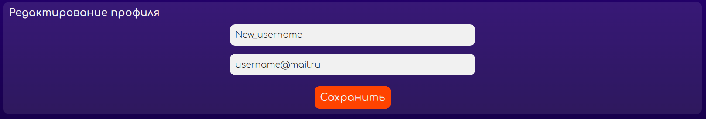

6. При введении символов, отличных от латинских букв, цифр и нижнего подчеркивани, при внесении изменений в логин и клика на кнопку "Сохранить" высвечивается сообщение об ошибке с указанием символов, которые можно вводить.
> [!WARNING]
> БАГ. При введение в поле изменения логина невалидных символов появляется сообщение, которое выходит за пределы поля логина и имеет нечитаемый цвет.
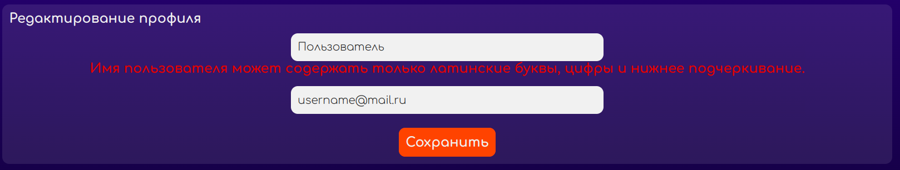

7. При изменении логина на логин размера, не соответсвующего размеру от 4 до 16 символов, и клика на кнопку "Сохранить" высвечивается сообщение об ошибке с указанием допустимого размера логина.
> [!WARNING]
> БАГ. При введении логина невалидного размера появляется сообщение, которое выходит за пределы поля логина и имеет нечитаемый цвет.
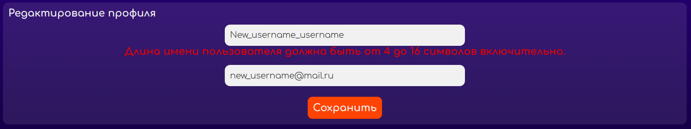

8. При попытке изменения логина на уже существующий в базе после клика на кнопку "Сохранить" высвечивается сообщение об ошибке c указанием, что профиль с таким логином уже существует.
> [!WARNING]
> БАГ. При изменении логина на уже существующий высвечивается сообщение о неизвестной ошибке под всеми полями ввода, которое имеет нечитаемый цвет.
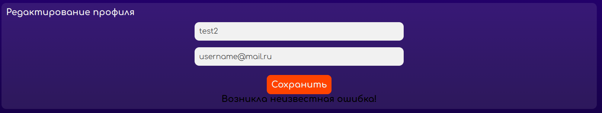

9. После внесения изменений в почту и клика на кнопку "Сохранить" происходит редирект на страницу с карточкой профиля. Почта изменилась на введенную, что можно проверить в настройках профиля.
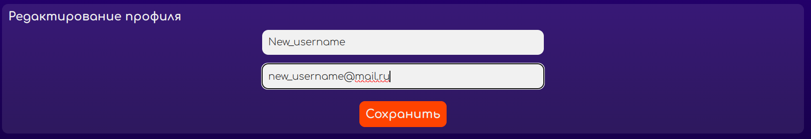

10. При введение невалидных форматов почты после клика на кнопку "Сохранить" высвечиваются сообщения с подсказками.
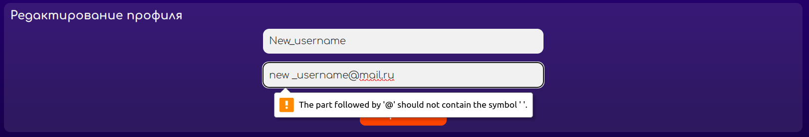

11. При попытке изменения почты на уже существующую в базе после клика на кнопку "Сохранить" высвечивается сообщение об ошибке c указанием, что профиль с такой почтой уже существует.
> [!WARNING]
> БАГ. При изменении почты на уже существующую высвечивается сообщение о неизвестной ошибке под всеми полями ввода, которое имеет нечитаемый цвет.
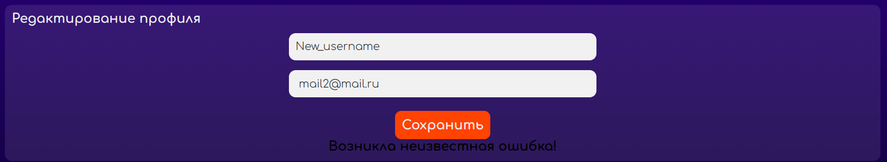

### 3.3 Карточка профиля

1. Количество подписок, указанных в карточке профиля, совпадает с реальным количеством подписок на странице подписок, на которую можно перейти по клику на кнопку "Подписки".

2. При уменьшении размера ширины экрана аватар профиля располагается над информацией о подписках и кнопками "Подписки" и "Настройки профиля". 
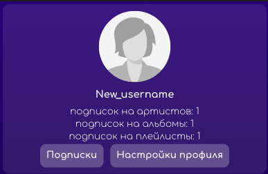

