# Отчет о тестировании музыкального сервиса NovaCode

Ссылка: [nova-music.ru](http://nova-music.ru)

## Навбар

#### Тестовое окружение

- Браузер: Safari. Version 18.3 (20620.2.4.11.5)

### Левая секция навбара

В левой секции навбара присутствует логотип сервиса, название и несколько ссылок, которые осуществляют навигацию  по сайту: переход на главную страницу, переход на страницу поиска.

- При нажатии на кнопку "Главная" отображается главная страница, а кнопка "Главная" подчеркивается оранжевым цветом
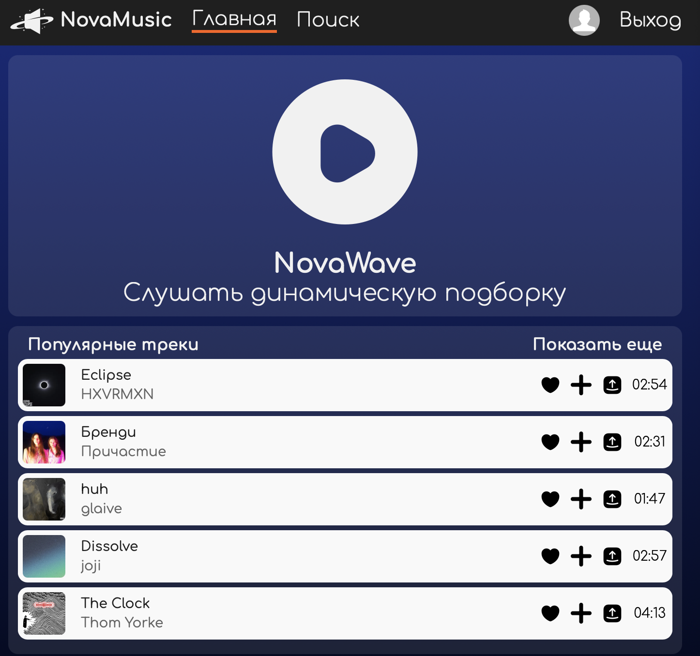

- При нажатии на кнопку "Поиск" отображается страница поиска, а кнопка "Поиск" подчеркивается оранжевым цветом
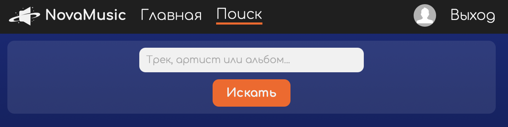

- При нажатии на название или логотип сервиса отображается главная страница
> [!WARNING]
> БАГ. На логотип нельзя нажать.

- При наведении на название сервиса, кнопку "Главная", "Поиск" текст кнопки затемняется

- При уменьшении размера ширина экрана/браузера, а также на мобильных устройствах кнопки "Главная", "Поиск"  скрываются и перемещаются в sidebar справа

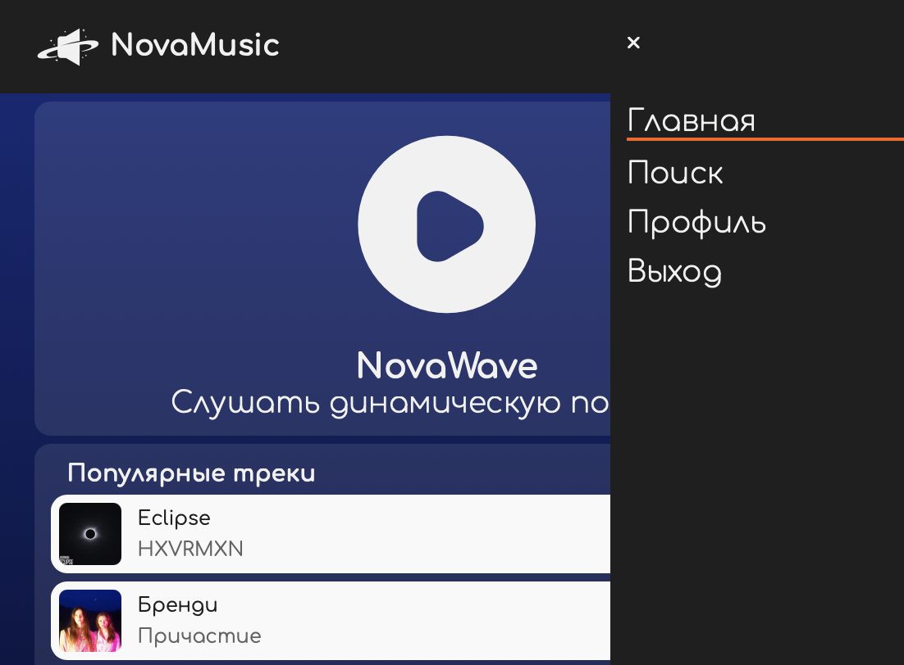

### Правая секция навбара неавторизованного пользователя

Для неавторизованного пользователя в правой секции навбара располагаются кнопки "Войти", "Регистрация" для перемещения на соответствующие страницы.

- При нажатии на кнопку "Войти" отображается страница авторизации, а кнопка "Войти" подчеркивается оранжевым цветом
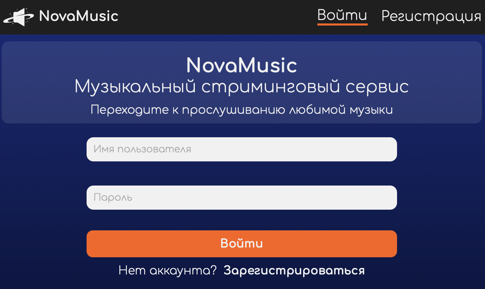

- При нажатии на кнопку "Регистрация" отображается страница регистрации, а кнопка "Регистрации" подчеркивается оранжевым цветом
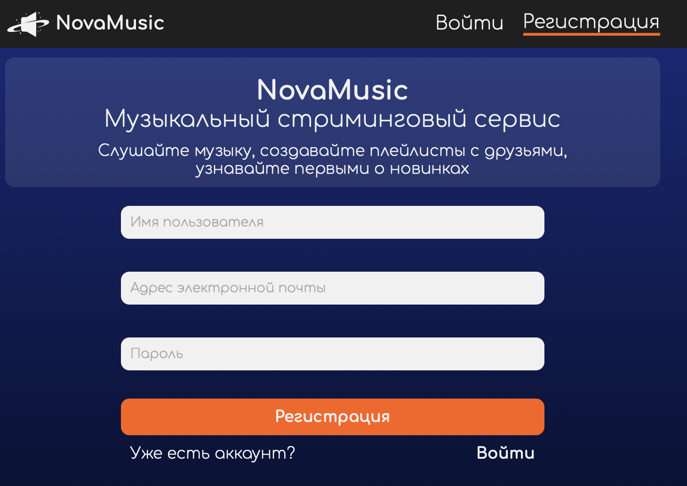

- При уменьшении размера ширина экрана/браузера, а также на мобильных устройствах кнопки "Войти", "Регистрация"  скрываются и перемещаются в sidebar справа

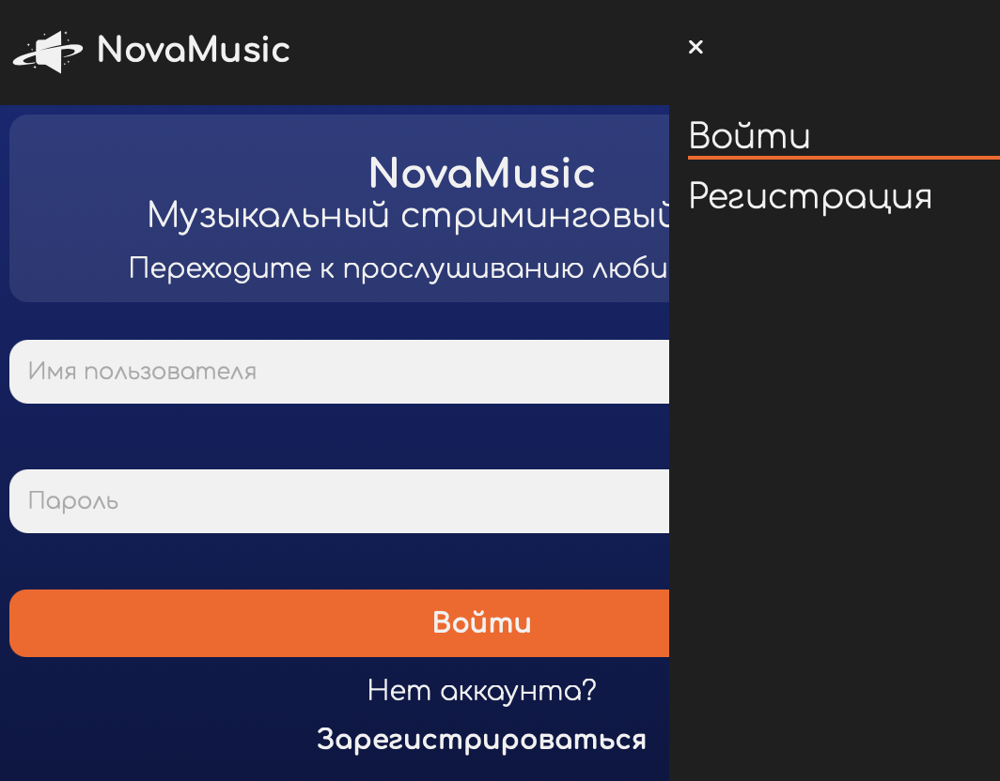

### Правая секция навабара авторизованного пользователя

Для авторизованного пользователя в правой секции навбара располагаются кнопка "Выход" для выхода из аккаунта профиля и аватарка пользователя, при нажатии на которую отображается страница профиля пользователя.

- При нажатии на аватарку пользователя отображается страница профиля пользователя
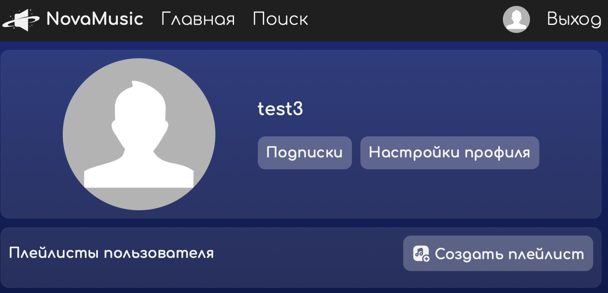

- При нажатии на кнопку "Выход" отображается модальное окно подтверждения выхода из аккаунта пользователя
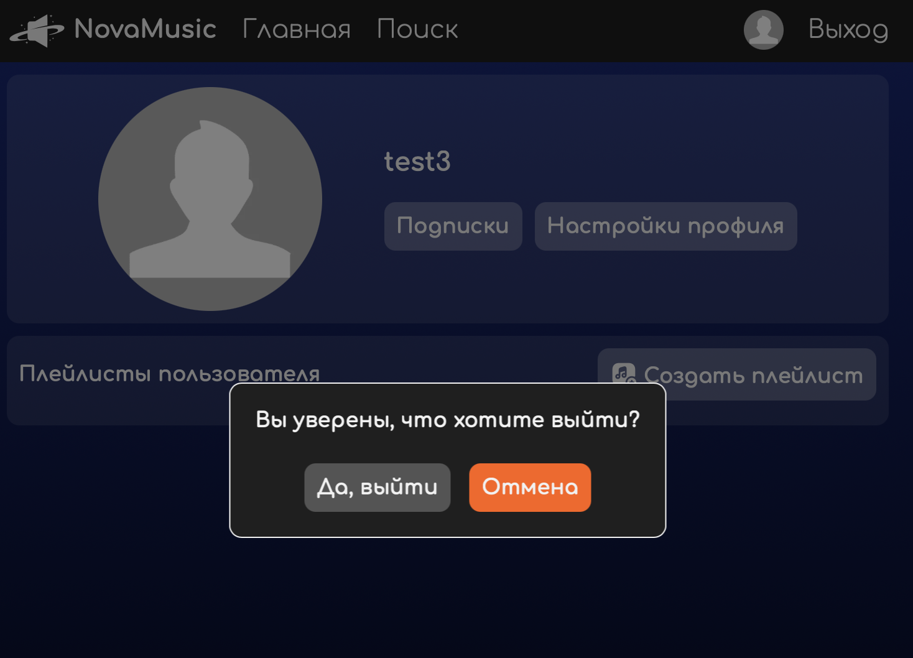

- При наведении на кнопку "Выход" текст кнопки затемняется

### Sidebar

Компактная навигационная панель, отображающася при уменьшении ширины браузера или на мобильных устройствах.

- При нажатии на правую кнопку в навбаре отобразится sidebar с кнопками "Главная", "Поиск", "Профиль", "Войти" "Регистрация" для неавторизованного пользователя и с кнопками "Главная", "Поиск", "Профиль", "Выход" для авторизованного пользователя

- При нажатии на кнопки "Главная", "Поиск", "Профиль", "Выход" для авторизованного пользователя и на кнопки "Войти", "Регистрация" для неавторизованного пользователя отображается соответствующая страница, а сама кнопка подчеркивается оранжевым цветов
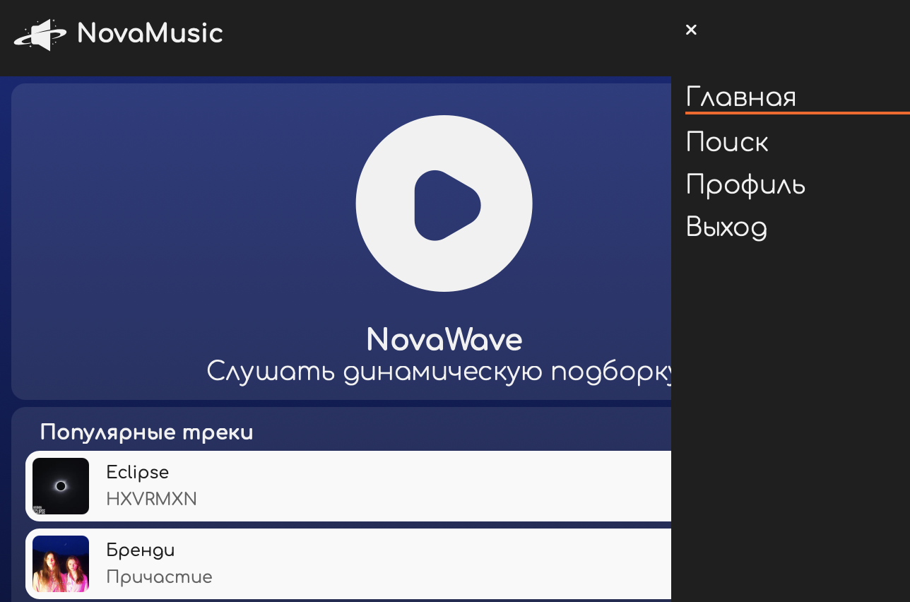
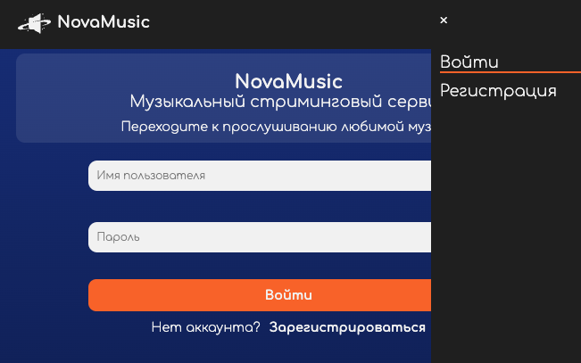

- При наведении на кнопки "Главная", "Поиск", "Профиль", "Выход" для авторизованного пользователя и на кнопки "Войти", "Регистрация" для неавторизованного пользователя текст затемняется
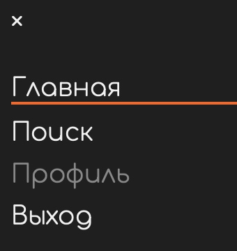
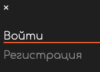

- При нажатии на кнопку "Выход" появляется модальное окно для подтверждения выхода из аккаунта
> [!WARNING]
> БАГ. При нажатии на кнопку "Выход" модальное окно для подтверждения выхода не появляется

- При нажатии на крестик в левом верхнем углу панель sidebar скрывается

- Sidebar не скрывается при нажатии на область вне панели

### Модальное окно подтверждения выхода

Модальное окно для подтверждения выхода из аккаунта пользователя.

- При нажатии на кнопку "Да, выйти" происходит выход из аккаунта, редирект на страницу авторизации, а кука с JWT-токеном стирается из браузера
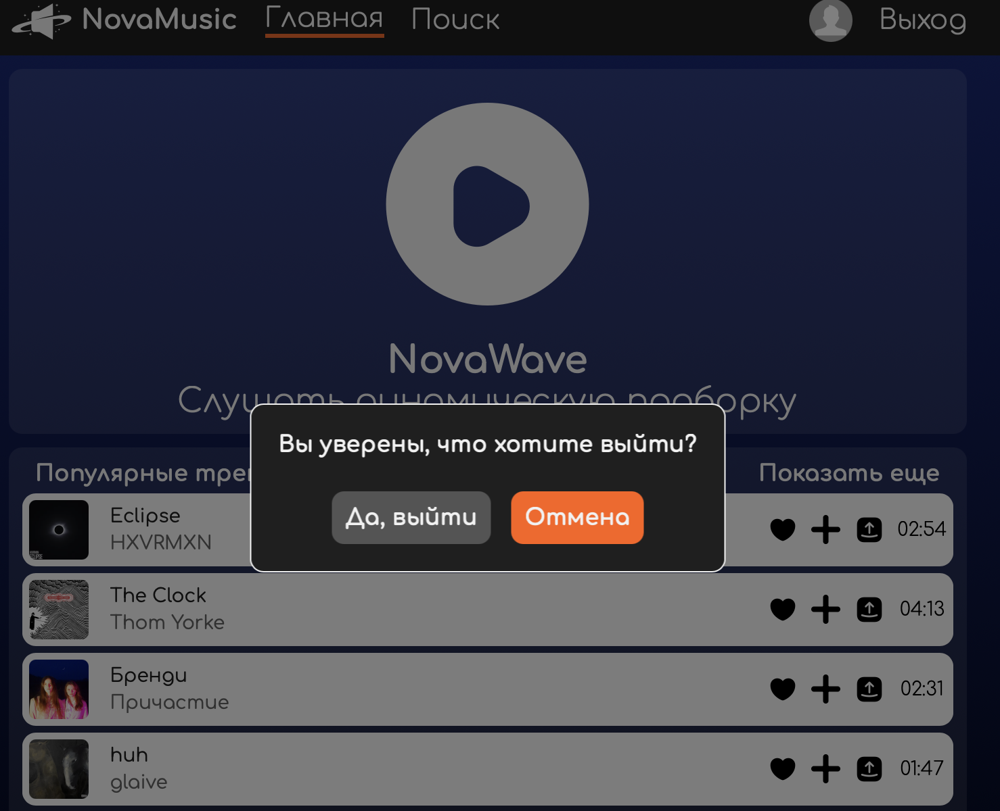

- При наведении на кнопку "Да, выйти" затемнение кнопки не происходит

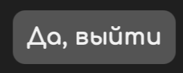

- При наведении на кнопку "Отмена" выделение кнопки не происходит

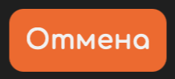

- Модальное окно не скрывается при нажатии на область вне этого окна

- При открытии модального окна происходит затемнение страницы
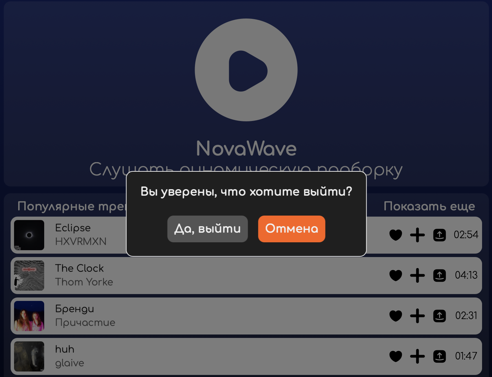

## Поиск

#### Тестовое окружение

- Браузер: Safari. Version 18.3 (20620.2.4.11.5)

### Строка поиска

Место ввода поискового запроса, под которым располагается кнопка "Искать".

- При клике на строку поиска происходит выделение инпута синим
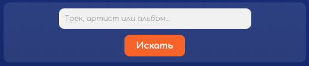

- При вводе символов в поисковую строку подсказки не появляются
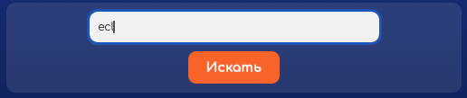

- Если в стркое поиска введен запрос, то снизу, в блоке с результатом поиска, отображаются совпадения
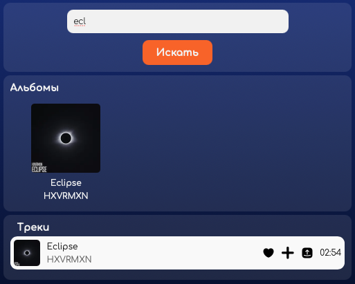

- При наведении на кнопку "Искать" затемнения/выделения не происходит

- При клике на кнопку "Искать" затемнения/выделения не происходит

- Если нажать на кнопку "Искать" и если в поисковой строке ничего нет, то отобразится подсказка "Заполните это поле" на языке браузера

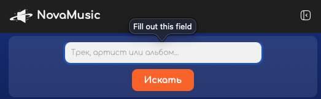

- При вводе в строку поиска запроса, содержащего цифры, отображаются найденные совпадения (если они есть)
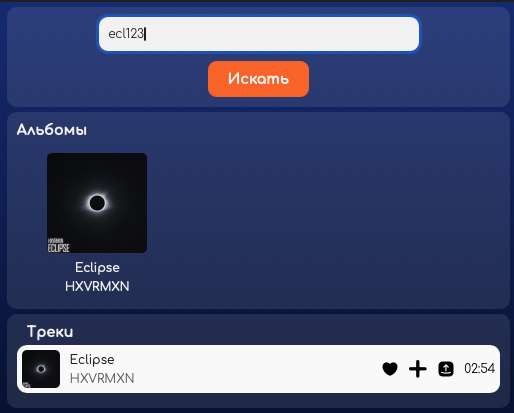

- При вводе в строку поиска запроса на русском языке отображаются найденные совпадения (если они есть)
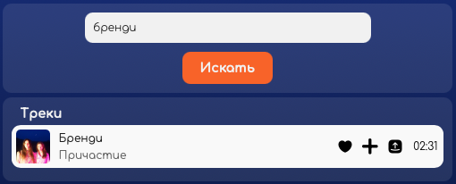

- При вводе в строку поиска запроса, содержащего символы из utf, отображаются найденные совпадения (если они есть)
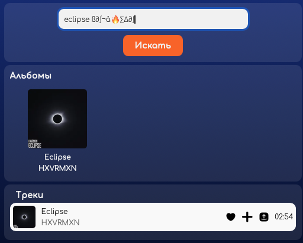

- Нажатие на клавишу "Enter" инициирует логику поиска

- Ввод длинного запроса (32901 символа) не ломает поиск
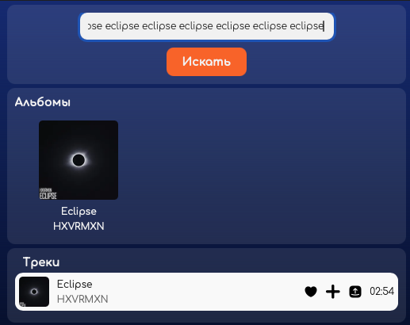
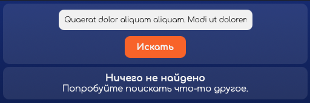

- При вводе пробелов в строку поиска отображается панель "Ничего не найдено"
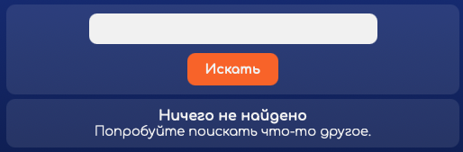

- Регистр символов введенной строки не влияет на результат поиска
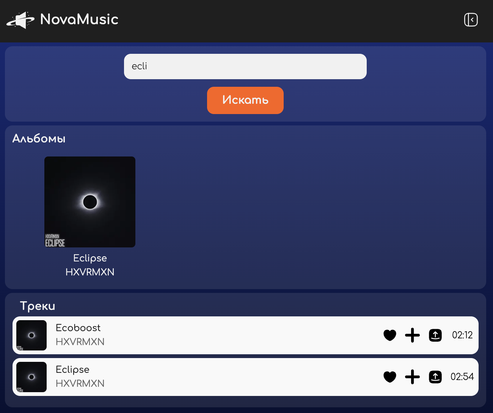

### Блок с результатом поиска

Раздел страницы, содержащий три блока с найденными совпадениями для артистов, треков и альбомов.

- Если в блоке с результатом поиска отображаются совпадения и если в строке поиска ввести запрос и нажать кнопку "Искать", то в блоке с результатом будут отображаться совпадения для нового запроса

> [!WARNING]
> БАГ. Если в блоке с результатом поиска уже отображаются совпадения, среди которых есть совпадения с треком, и если ввести новый запрос, для которого не будет найдено ни одного трека (при этом альбом или артист может быть найден), то в блоке с результатом появится трек/треки, относящиеся к последнему запросу, для которого был найден трек/треки.
> 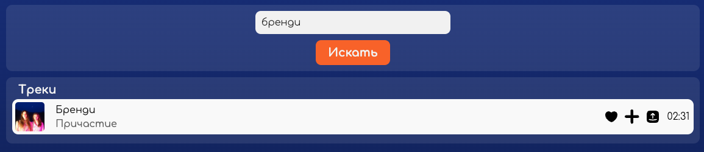
> 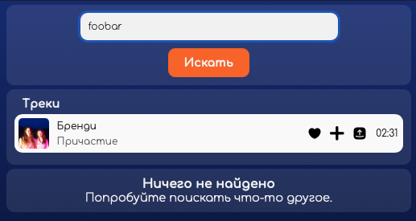

- Если в поисковой строке ввести запрос, для которого не будет ничего найдено, то отобразится блок с надписью "Ничего не найдено" и подсказкой "Попробуйте поискать что-то другое."
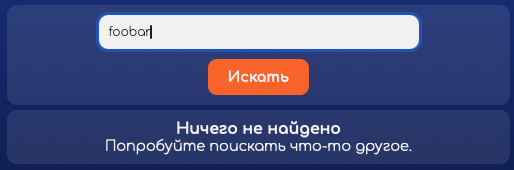

- При загрузке страницы блок скрыт

