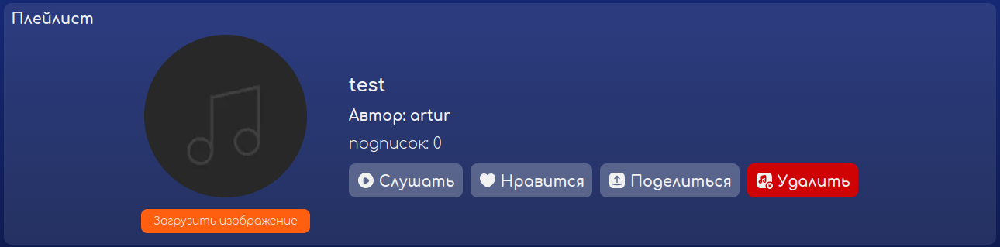
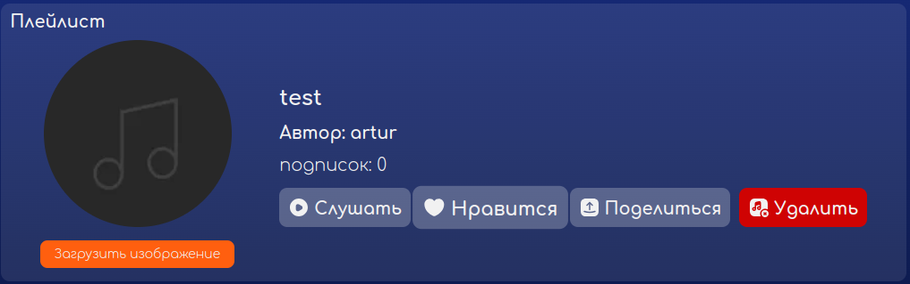
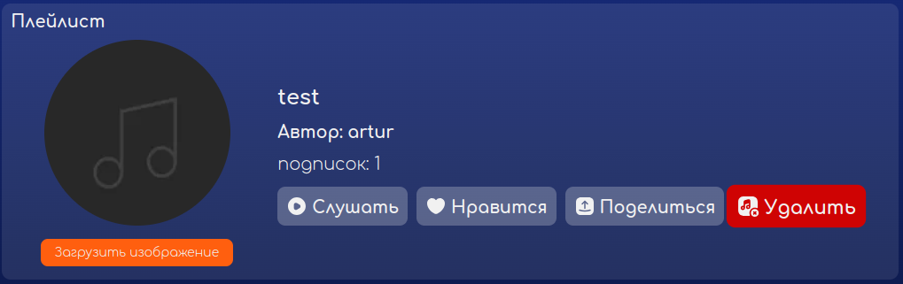
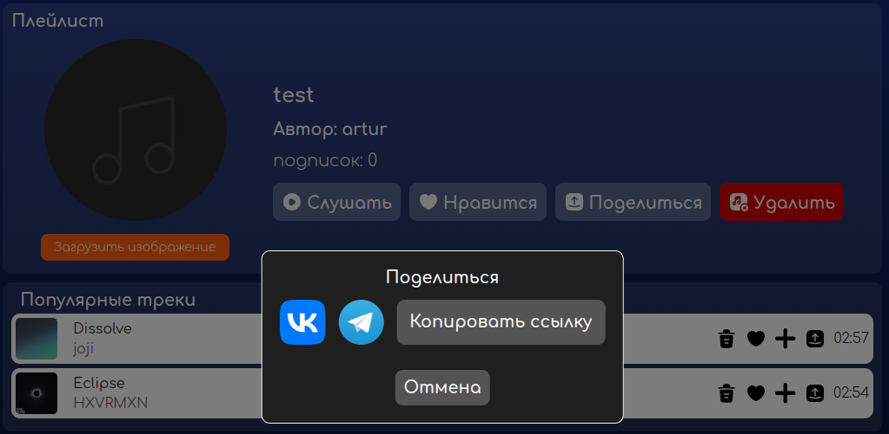
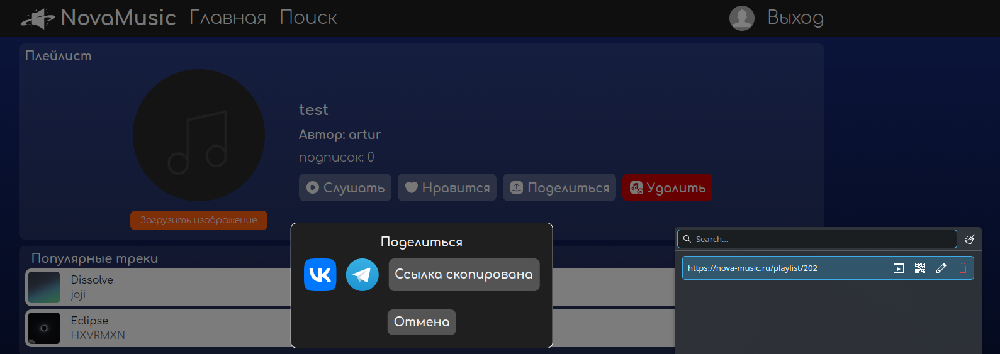
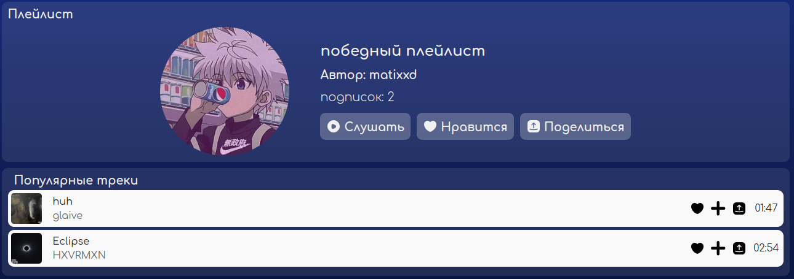
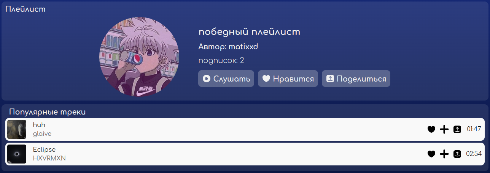
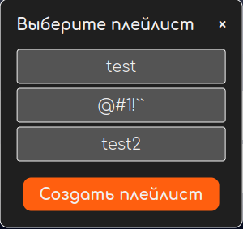
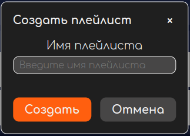
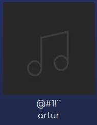

# Отчет о тестировании музыкального сервиса NovaCode

Ссылка: [nova-music.ru](http://nova-music.ru)

## Плейлисты

#### Окружение
Браузер: Opera One, version 117.0.5408.53
Система: Arch Linux (x86_64; KDE)
Версия Chromium: 132.0.6834.210

### Страница плейлиста

- при посещении страницы неавторизованным пользователем должен просиходить редирект на страницу входа

> BUG: при посещении страницы неавторизованным пользователем отображается пустая страница, нет сообщения о ошибке и не работают кнопки навбара

#### Информация о плейлисте и элементы управления

- при нажатии кнопки "загрузить изображение" открывается окно с проводником для выбора файла

- после выбора изображения в проводнике оно загружается и становится аватаркой плейлиста

> BUG: картинка не загружается и не появляется сообщение об ошибке

- при нажатии кнопки "слушать" начинают играть треки из плейлиста

- все элементы управления увеличиваются при наведении

*курсор на кнопке "нравится"*

- при нажатии кнопки "нравится" она загорается зеленым

- при нажатии кнопки "нравится" плейлист добавляется в понравившиеся

- при нажатии кнопки "нравится" увеличивается счетчик подписок на плейлист

> BUG: счетчик подписок увеличивается только после перезагрузки страницы

*до обновления*

*после обновления*

- при нажатии на зеленую кнопку "нравится" ее цвет меняется на исходный прозрачный

- при нажатии на зеленую кнопку "нравится" плейлист убирается из понравившихся

- при нажатии на зеленую кнопку "нравится" уменьшается счетчик подписок на плейлист

> BUG: счетчик подписок уменьшается только после перезагрузки страницы

- при нажатии на кнопку "поделиться" всплывает модальное окно с возможностями шеринга

- при появившемся модальном окне шеринга остальная страница недоступна для взаимодействия

> BUG: при появившемся модальном окне шеринга плеер остается доступен для взаимодействия

- при нажатии на логотип ВК в модальном окне шеринга происходит редирект на страницу шеринга плейлистом в ВК

- при нажатии на логотип Telegram в модальном окне шеринга происходит редирект на страницу шеринга плейлистом в Telegram

- при нажатии на кнопку "копировать ссылку" в модальном окне шеринга ссылка копируется в буфер обмена

- при нажатии на кнопку "копировать ссылку" в модальном окне шеринга текст кнопки меняется на "ссылка скопирована"

- при нажатии на кнопку "отмена" в модальном окне шеринга оно закрывается, страница становится доступной для взаимодействия

- кнопка "удалить" не видна другим пользователям, кроме автора плейлиста

*плейлист другого автора*

- при нажатии на кнопку "удалить" плейлист удаляется и больше не отображается в плейлистах пользователя

- при нажатии на кнопку "удалить" происходит редирект на страницу профиля пользователя

#### Треки и управление треками в плейлисте

- секция с треками плейлиста называется "треки плейлиста"

> BUG: секция с треками называется "популярные треки", а не "треки плейлиста"

- при наведении на трек появляется оранжевая рамка

*курсор на первом треке*

- кнопка удаления трека из плейлиста появляется только у автора плейлиста

*плейлист другого автора*

- при нажатии на кнопку удаления трека он моментально пропадает из плейлиста

- при добавлении трека в плейлист, в котором он уже есть, добавление не происходит

### Модальное окно добавления в плейлист

- при появившемся модальном окне добавления в плейлист остальная страница недоступна для взаимодействия

> BUG: при появившемся модальном окне добавления в плейлист плеер остается доступен для взаимодействия

- при нажатии кнопки добавления в плейлист на странице появляется модальное окно с возможными плейлистами для добавления

- при нажатии кнопки добавления в плейлист в плеере появляется модальное окно с возможными плейлистами для добавления

- при наведение на плейлист в модальном окне его название подчеркивается

- при добавлении трека в плейлист происходит редирект на этот плейлист

- при нажатии на кнопку "создать плейлист" появляется окно для ввода названия для нового плейлиста

- после создания плейлиста он появляется в плейлистах, возможных для добавления

### Окно создания плейлиста

- при появившемся модальном окне создания плейлиста остальная страница недоступна для взаимодействия

> BUG: при появившемся модальном окне создания плейлиста плеер остается доступен для взаимодействия

- название плейлиста может содержать любые символы, плейлист успешно создается

- при создании плейлиста со слишком длинном названием появляется сообщение об ошибке

> BUG: при слишком длинном названии плейлиста плейлист не создается и не появляется сообщение об ошибке

- при создании пользователем второго плейлиста с таким же названием появляется сообщение об ошибке

> BUG: при создании пользователем второго плейлиста с таким же названием плейлист не создается и не появляется сообщение об ошибке
