# Отчет о тестировании музыкального сервиса NovaCode

Ссылка: [nova-music.ru](http://nova-music.ru)

## 4. Страница исполнителя

Перейти на страницу исполнителя можно по клику на аватар исполнителя в карусели популярных исполнителей на главной странице.

#### Тестовое окружение

- Браузер: Yandex. Version 24.7.3.1253 stable (64-bit)

### 4.1 Карточка исполнителя

1. В левой части расположен аватар исполнителя, в правой - имя исполнителя, жанр, количество подписок и кнопки "Слушать", "Нравится" и "Поделиться".
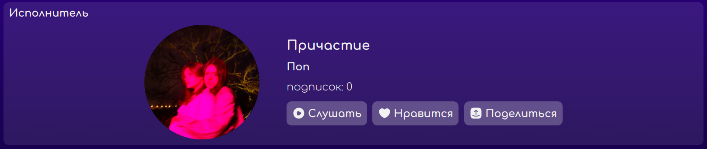

2. При уменьшении ширины экрана аватар располагается над имем исполнителя, жанром, количеством подписок и кнопками "Слушать", "Нравится" и "Поделиться".
Названия кнопок "Слушать", "Нравится" и "Поделиться" исчезают и остаются только их иконки. 
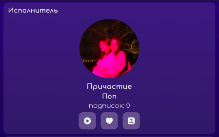

3. Количество подписок отображается у авторизованного и неавторизоованного пользователя.
> [!WARNING]
> БАГ. При открытии страницы исполнителя неавторизованным пользователем количество подписок не отображается. 

4. При клике на кнопку "Слушать" у авторизованного и неавторизованного пользователя начинается воспроизведение треков испольнителя.

5. При клике на кнопку "Нравится" авторизованный пользователь добавляет исполнителя к себе в подписки, и после обновления страницы количество подписок на исполнителя увеличивается на один.
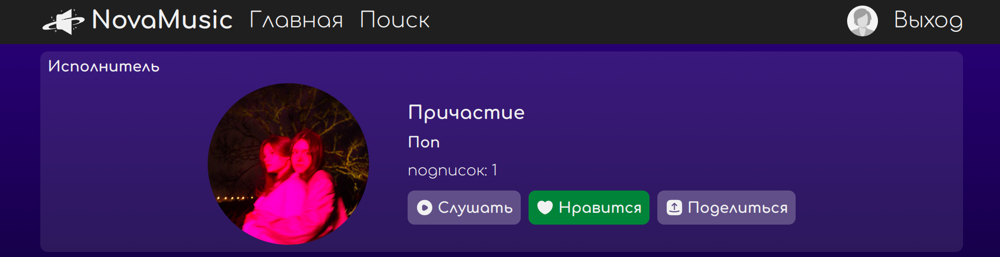

6. Кнопка "Нравится" отсутствует у неавторизованного пользователя.
> [!WARNING]
> БАГ. Кнопка "Нравится" отображается у неавторизованного пользователя, при клике она становился зеленой, но нельзя отменить действие и при обновлении страницы оценка слетает. 
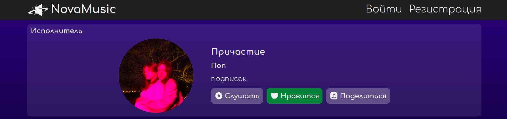

7. При клике на кнопку "Поделиться" отбражается модальное окно с вариантами отправки: через VK, Telegram и путем копирования ссылки, а также возможностью отменить действие.  
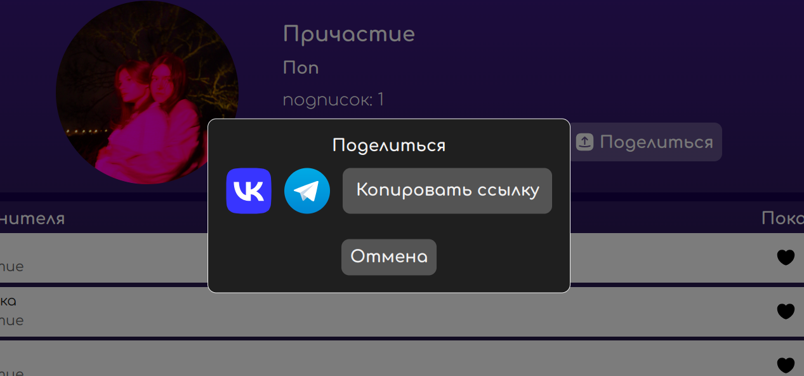

    7.1 Клик на иконку VK или Telegram открывает новую окно в браузере с возможностью поделиться ссылкой. 

    7.2 Клик на кнопку "Копировать ссылку" копирует ссылку в буфер и перевод кнопку в состояние "Ссылка скопирована".  
    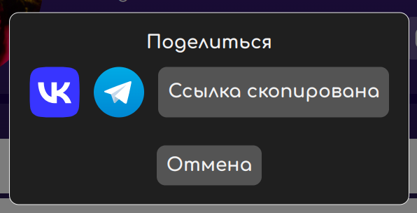

    7.3 Кнопка "Отмена" закрывает модальное окно.

    7.4 При клике на область за пределами модального окна, окно не скрывается.

### 4.2 Список треков исполнителя

1. В списке треков исполниетля отображаются только его треки.
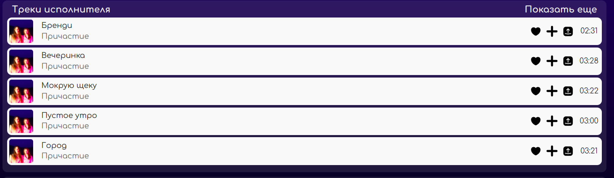

2. При наведении на ссылку "Показать еще" она подчеркивается оранжевым цветом. 
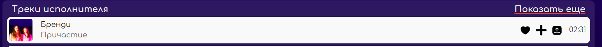

3. При клике на ссылку "Показать еще" в правом верхнем углу списка треков осуществляется редирект на страницу со всеми треками исполнителя.
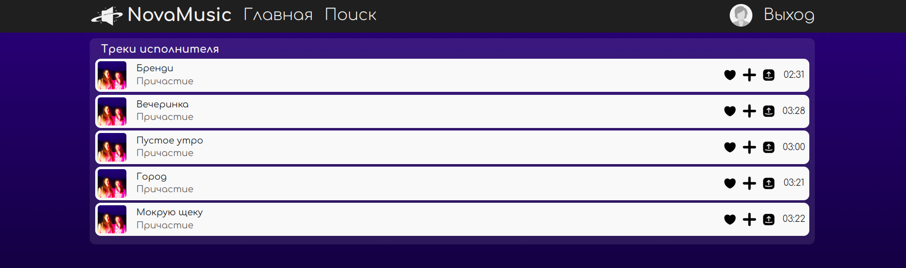

4. При клике на трек из списка треков начинается его воспроизведение.

### 4.3 Карусель с альбомами исполнителя 

1. В карусели с альбомами исполнителя отображаются только его альбомы.
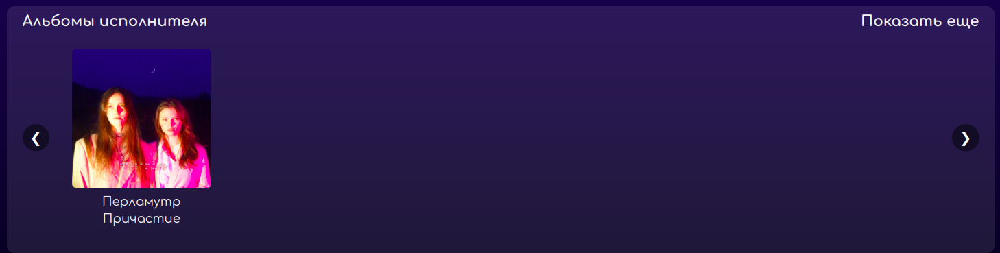

2. При наведении на ссылку "Показать еще" она подчеркивается оранжевым цветом. 
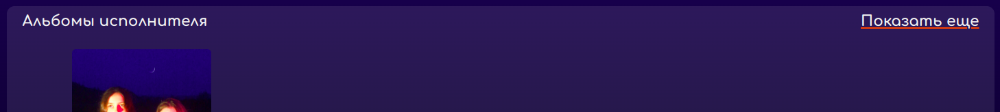

3. При клике на ссылку "Показать еще" в правом верхнем углу карусели с альбомами осуществляется редирект на страницу со всеми альбомами исполнителя.
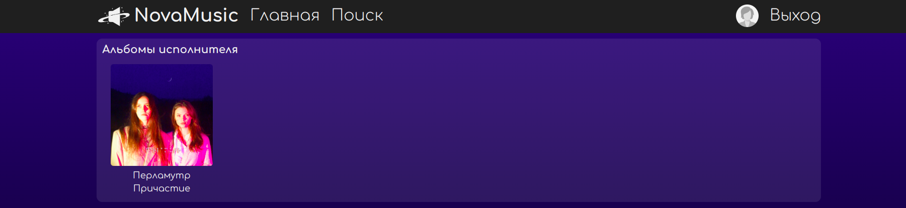

4. При клике на альбом из карусели осуществляется переход на страницу альбома.

### 4.4 Плеер на странице исполнителя

1. Треки в плеере проигрываются в той же последовательности, в которой они расположены в списке треков исполнителя.
> [!WARNING]
> БАГ. Перемещение между треками в плеере не связан с последовательностью треков на странице

2. При нахождении на странице исполнителя в плеере проигрываются только его треки, после проигрывания последнего трека проигрывание начинается сначала.

3. У неавторизованного пользователя есть возможность слушать треки только путем клика на кнопку "Слушать" в карточке исполнителя.
> [!WARNING]
> БАГ. Неавторизованный пользователя может включать все треки из списка треков, при этом у него не отображается плеер, и возникает неочевидное поведение с возможностью остановить трек только путем нажатия кнопки "Слушать" в карточке исполнителя.
