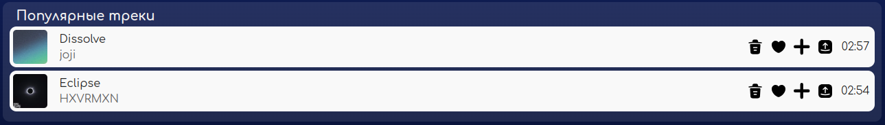
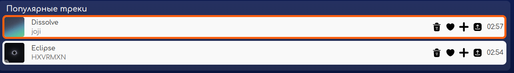
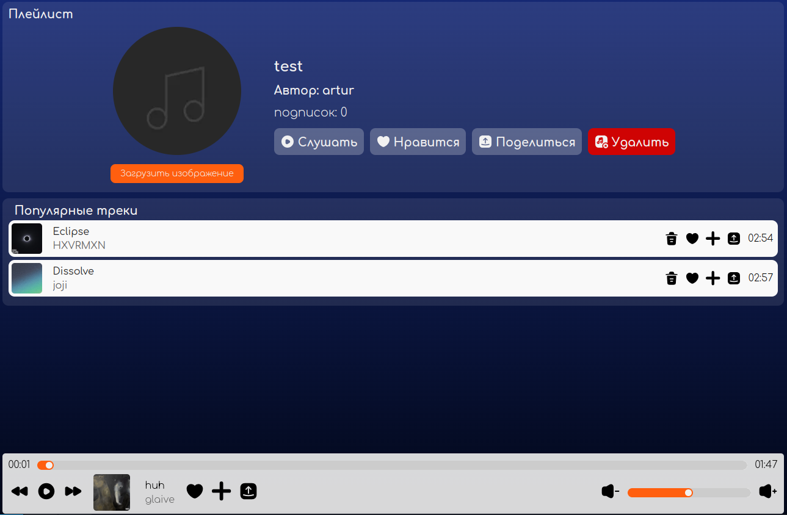

# Отчет о тестировании музыкального сервиса NovaCode

Ссылка: [nova-music.ru](http://nova-music.ru)

## Плейлисты

**Окружение**
Браузер: Opera One, version 117.0.5408.53
Система: Arch Linux (x86_64; KDE)
Версия Chromium: 132.0.6834.210

### Страница плейлиста
#### Информация о плейлисте и элементы управления

- при нажатии кнопки "загрузить изображение" открывается окно с проводником для выбора файла

> BUG: картинка не загружается, не появляется сообщение об ошибке, в консоли 500 Internal server error {"error":"failed to upload images/image"}

- при нажатии кнопки "слушать" начинают играть треки из плейлиста

- все элементы управления увеличиваются при наведении

*курсор на кнопке "нравится"*

- при нажатии кнопки "нравится" она загорается зеленым

- при нажатии кнопки "нравится" плейлист добавляется в понравившиеся

> BUG: счетчик подписок (лайков) увеличивается только после перезагрузки страницы

*до обновления*

*после обновления*

- при нажатии на зеленую кнопку "нравится" ее цвет меняется на исходный прозрачный

- при нажатии на зеленую кнопку "нравится" плейлист убирается из понравившихся

> BUG: счетчик подписок (лайков) уменьшается только после перезагрузки страницы

- при нажатии на кнопку "поделиться" всплывает модальное окно с возможностями шеринга

- при появившемся модальном окне шеринга остальная страница недоступна для взаимодействия

- при нажатии на логотип ВК в модальном окне шеринга происходит редирект на страницу шеринга плейлистом в ВК

- при нажатии на логотип Telegram в модальном окне шеринга происходит редирект на страницу шеринга плейлистом в Telegram

- при нажатии на кнопку "копировать ссылку" в модальном окне шеринга ссылка копируется в буфер обмена

- при нажатии на кнопку "копировать ссылку" в модальном окне шеринга текст кнопки меняется на "ссылка скопирована"

- при нажатии на кнопку "отмена" в модальном окне шеринга оно закрывается, страница становится доступной для взаимодействия

- кнопка "удалить" не видна другим пользователям, кроме автора плейлиста

*плейлист другого автора*

- при нажатии на кнопку "удалить" плейлист удаляется и больше не отображается в плейлистах пользователя

- при нажатии на кнопку "удалить" происходит редирект на страницу профиля пользователя

#### Треки и управление треками в плейлисте

> BUG: секция с треками называется "популярные треки", а не "треки плейлиста"

- при воспроизведении треков плейлиста и нажатии кнопок "вперед"/"назад" в плеере происходит переход на следующий/предыдущий трек в плейлисте

- при наведении на трек появляется оранжевая рамка

*курсор на первом треке*

- кнопка удаления трека из плейлиста появляется только у автора плейлиста

*плейлист другого автора*

- при нажатии на кнопку удаления трека он моментально пропадает из плейлиста

- при добавлении трека в плейлист, в котором он уже есть, добавление не происходит

> BUG: при удалении трека из плейлиста и нажатия кнопок "вперед"/"назад" в плеере удаленный трек может появится в очереди

*при перемотке треков плейлиста в очереди появился удаленный трек*

### Модальное окно добавления в плейлист

- при нажатии кнопки добавления в плейлист на странице появляется модальное окно с возможными плейлистами для добавления

- при нажатии кнопки добавления в плейлист в плеере появляется модальное окно с возможными плейлистами для добавления

- при наведение на плейлист в модальном окне его название подчеркивается

- при добавлении трека в плейлист происходит редирект на этот плейлист

- при нажатии на кнопку "создать плейлист" появляется окно для ввода названия для нового плейлиста

- после создания плейлиста он появляется в плейлистах, возможных для добавления

### Окно создания плейлиста

- название плейлиста может содержать любые символы, плейлист успешно создается

> BUG: при слишком длинном названии плейлиста плейлист не создается, не появляется сообщение об ошибке, в консоли 400 Bad request, в ответе {"error": "pq: new row for relation \"playlist\" violates check constraint \"playlist_name_length\""}

> BUG: при создании пользователем второго плейлиста с таким же названием плейлист не создается, не появляется сообщение об ошибке, в консоли 400 Bad request, в ответе {"error": "pq: duplicate key value violates unique constraint \"playlist_name_key\""}
