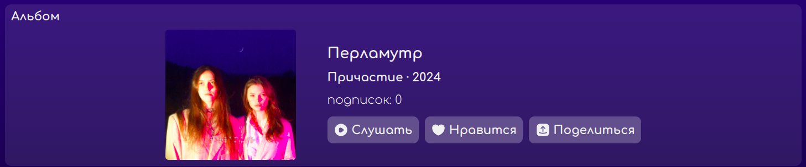
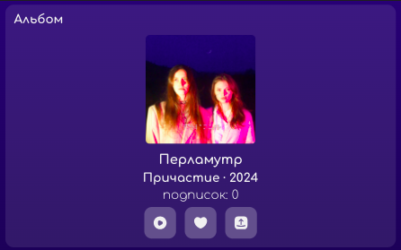
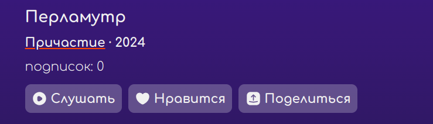
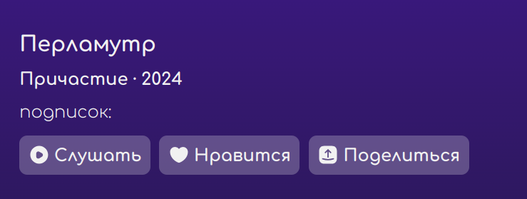
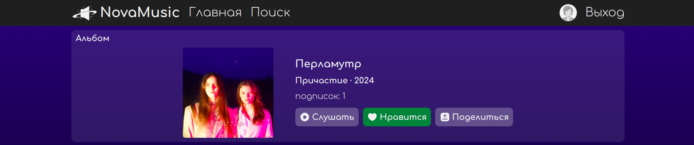
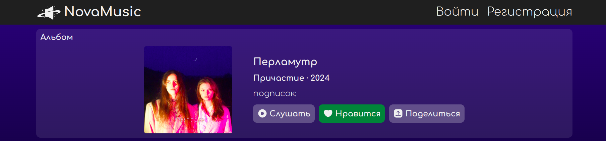
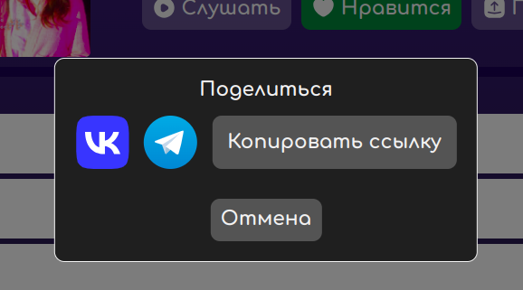
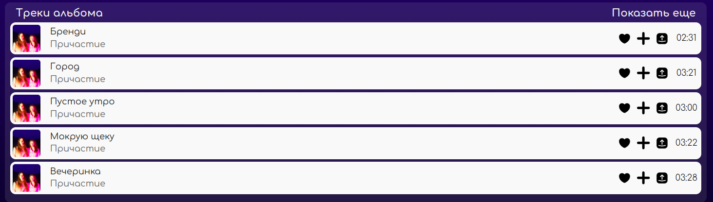
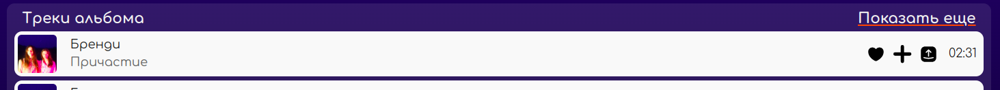
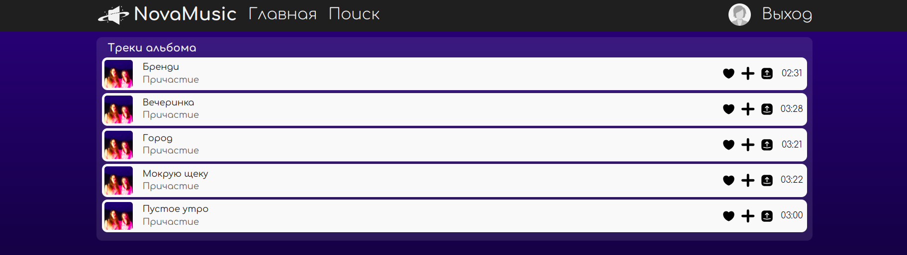

# Отчет о тестировании музыкального сервиса NovaCode

Ссылка: [nova-music.ru](http://nova-music.ru)

## 5. Страница альбома

Перейти на страницу альбома исполнителя можно через страницу исполнителя по клику на обложку альбома в карусели.

#### Тестовое окружение

- Браузер: Yandex. Version 24.7.3.1253 stable (64-bit)

### 5.1 Карточка альбома

1. В левой части расположена обложка альбома, в правой - название альбома, имя исполнителя альбома и год выпуска, количество подписок и кнопки "Слушать", "Нравится" и "Поделиться".

2. При уменьшении ширины экрана обложка располагается над названием альбома, именем исполнителя и годом выпуска, количеством подписок и кнопками "Слушать", "Нравится" и "Поделиться". Названия кнопок "Слушать", "Нравится" и "Поделиться" исчезают и остаются только их иконки. 

3. При наведении на имя исполнителя, ссылка подчеркивается оранжевым цветом. 

4. При клике на имя исполнителя осуществляется переход по ссылке на страницу исполнителя.

5. Количество подписок отображается у авторизованного и неавторизоованного пользователя.
> [!WARNING]
> БАГ. При открытии страницы альбома неавторизованным пользователем количество подписок не отображается. 

6. При клике на кнопку "Слушать" у авторизованного и неавторизованного пользователя начинается воспроизведение треков из альбома.

7. При клике на кнопку "Нравится" авторизованный пользователь добавляет альбом к себе в подписки, и после обновления страницы количество подписок на альбом увеличивается на один.

8. Кнопка "Нравится" отсутствует у неавторизованного пользователя.
> [!WARNING]
> БАГ. Кнопка "Нравится" отображается у неавторизованного пользователя, при клике она становился зеленой, но нельзя отменить действие и при обновлении страницы оценка слетает. 

9. При клике на кнопку "Поделиться" отбражается модальное окно с вариантами отправки: через VK, Telegram и путем копирования ссылки, а также возможностью отменить действие.  

    9.1 Клик на иконку VK или Telegram открывает новую окно в браузере с возможностью поделиться ссылкой. 

    9.2 Клик на кнопку "Копировать ссылку" копирует ссылку в буфер и перевод кнопку в состояние "Ссылка скопирована".  
    

    9.3 Кнопка "Отмена" закрывает модальное окно.

    9.4 При клике на область за пределами модального окна, окно не скрывается.

### 5.2 Список треков альбома

1. В списке треков альбома отображаются только треки этого альбома.

2. При наведении на ссылку "Показать еще" она подчеркивается оранжевым цветом. 

3. При клике на ссылку "Показать еще" в правом верхнем углу списка треков осуществляется редирект на страницу со всеми треками в альбоме.

4. При клике на трек из списка треков начинается его воспроизведение.

### 5.3 Плеер на странице альбома

1. Треки в плеере проигрываются в той же последовательности, в которой они расположены в списке треков альбома.
> [!WARNING]
> БАГ. Перемещение между треками в плеере не связан с последовательностью треков на странице.

2. При нахождении на странице альбома в плеере проигрываются только его треки, после проигрывания последнего трека проигрывание начинается сначала.

3. У неавторизованного пользователя есть возможность слушать треки только путем клика на кнопку "Слушать" в карточке альбома.
> [!WARNING]
> БАГ. Неавторизованный пользователя может включать все треки из списка треков, при этом у него не отображается плеер, и возникает неочевидное поведение с возможностью остановить трек только путем нажатия кнопки "Слушать" в карточке альбома.
